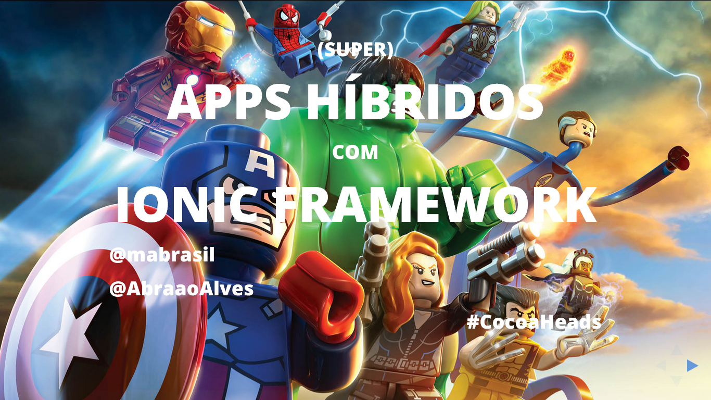

# Super Aplicações Híbridas com Ionic

## The talk

- **Title:** *Aplicações Híbridas com Ionic*
- **When:** May, 28
- **Where:** Instituto Federal de Educação, Ciência e Tecnologia do Ceará, Campus Fortaleza.
- **Attendees:** ≈40
- **Description:** [Abraão](https://github.com/AbraaoAlves) and I will make an overview of the features of [Ionic](http://ionicframework.com/): a framework for creating hybrid apps that has been growing more and more. It's free and open source and offers a HTML, CSS and JS library optimized for smartphones - as well as great tools that give us a great alternative for mobile development.
- **Presentation:** [See it live here](http://mabrasil.github.io/talks/2015/cocoaheads/).

## The slides

These slides are made using [xzibit](https://github.com/mabrasil/xzibit) v.1.0.0. To get more info on how to run and that kind of things, visit the project's page.

The slides' content is licensed under a [Creative Commons Attribution 3.0 Unported License](http://creativecommons.org/licenses/by/3.0/deed.en_GB).
